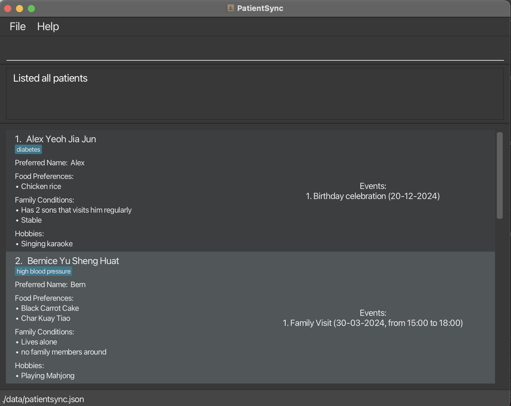
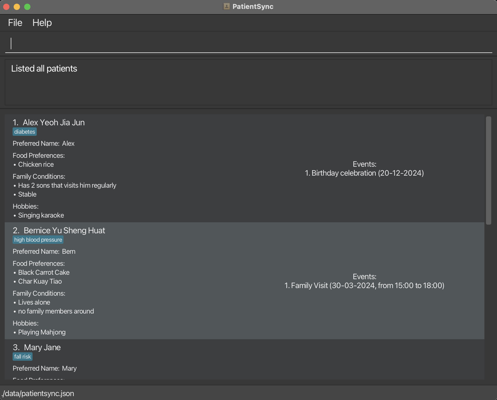
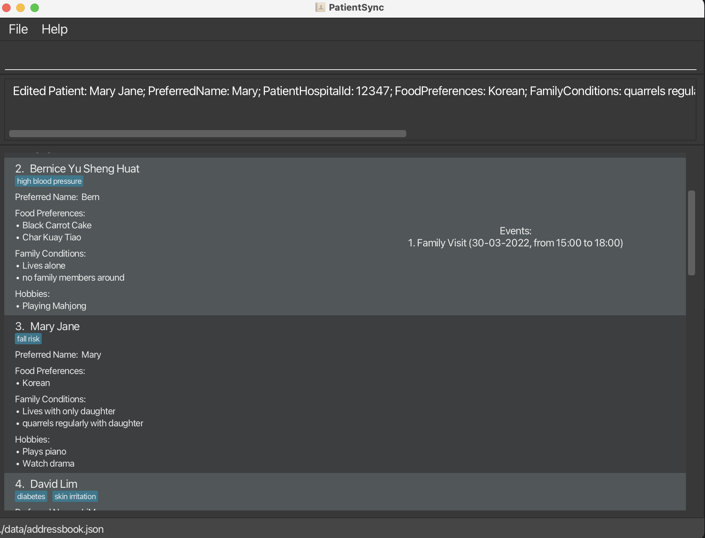
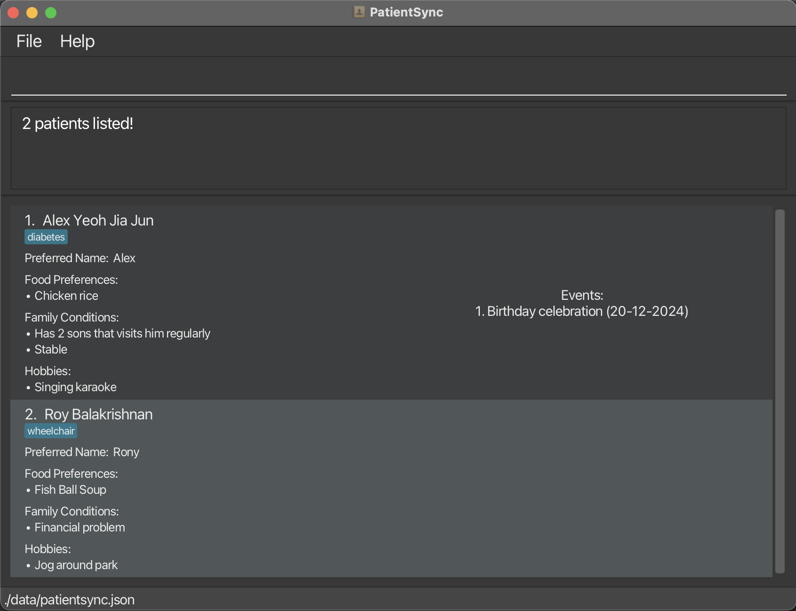
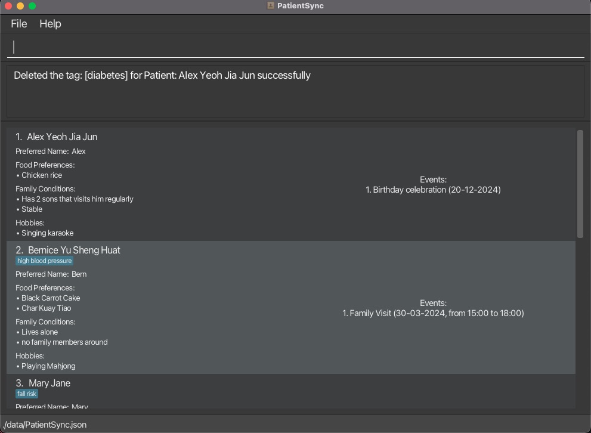
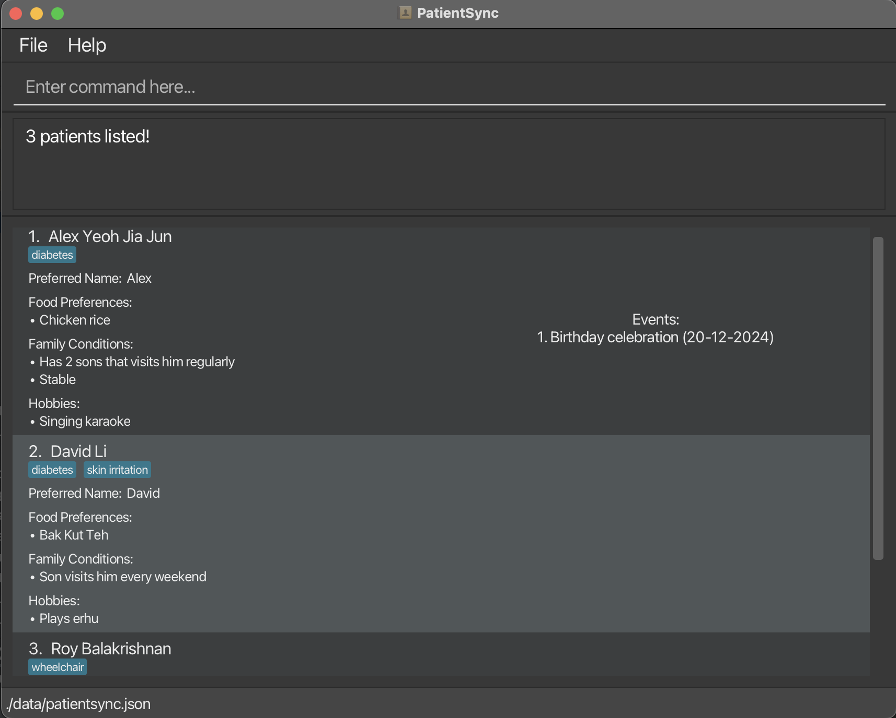
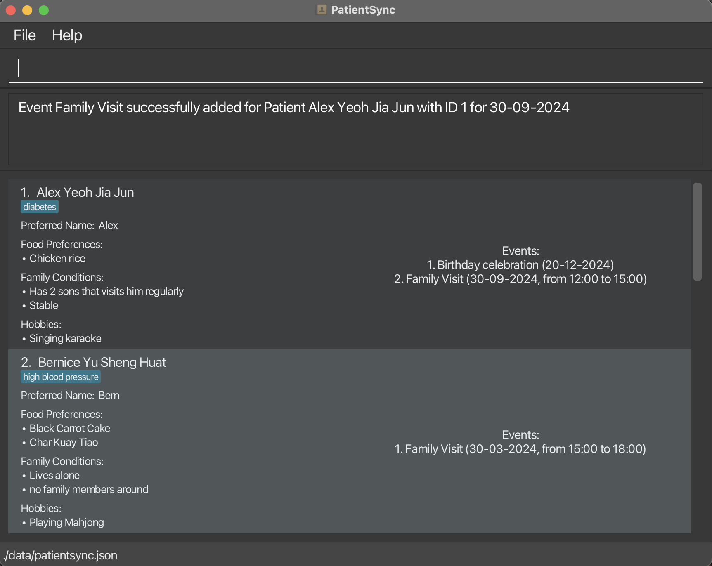
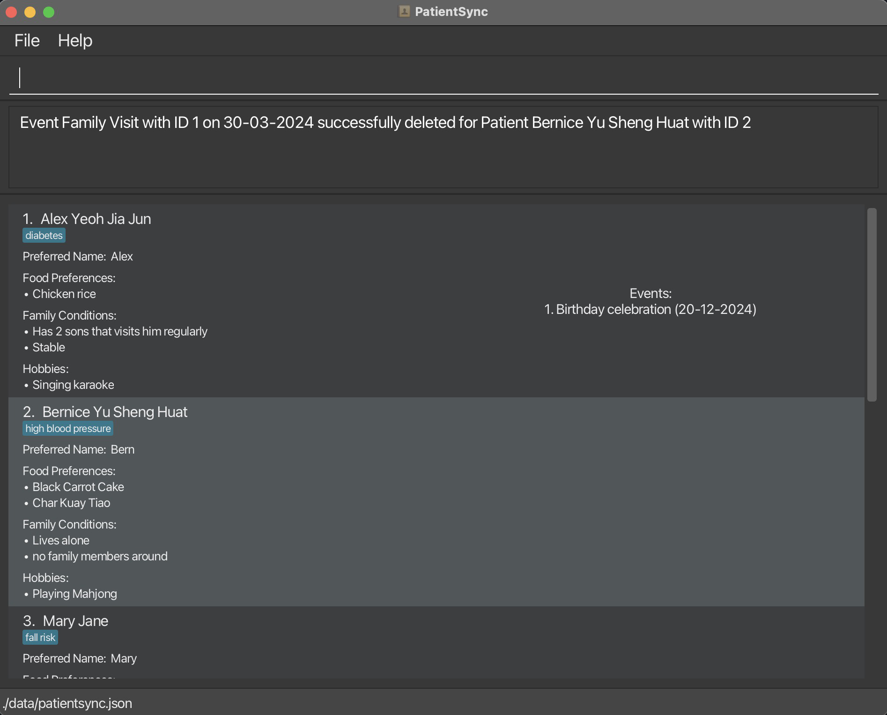
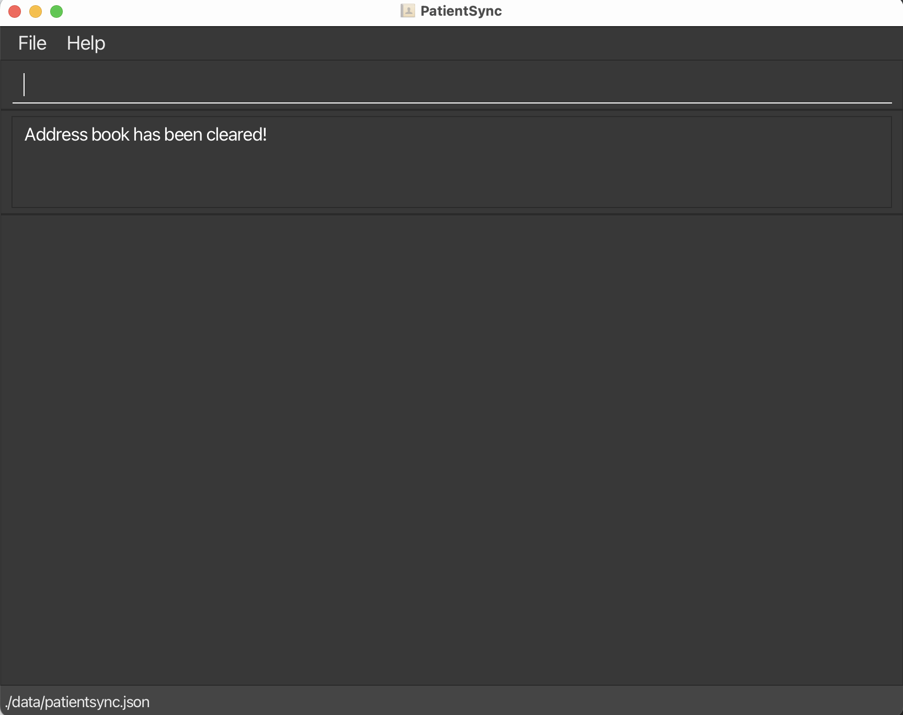

# PatientSync User Guide

PatientSync is a **desktop app made for nurses to manage patient, optimized for use via a Command Line Interface** (CLI) while still having the benefits of a Graphical User Interface (GUI). If you can type fast, PatientSync allows you to add and view patients intimate details and also manage patient-specific tasks faster than traditional GUI apps.

<!-- * Table of Contents -->
<page-nav-print />

--------------------------------------------------------------------------------------------------------------------

--------------------------------------------------------------------------------------------------------------------

## Quick start

1. Ensure you have Java `11` or above installed in your Computer. 

1. Download the latest `PatientSync.jar` from [here](https://github.com/AY2324S2-CS2103-F09-2/tp/releases).

1. Copy the file to the folder you want to use as the _home folder_ for your AddressBook.

1. Open a command terminal, `cd` into the folder you put the jar file in, and use the `java -jar PatientSync.jar`
command to run the application. 
   A GUI similar to the below should appear in a few seconds. Note how the app contains some sample data. 
   

1. Type the command in the command box and press Enter to execute it. e.g. typing **`help`** and pressing Enter will open the help window. 
   Some example commands you can try:

   * `list` : Lists all contacts.

   * `add id/ 12345 n/ John Doe p/ Alex f/ Curry chicken c/ Stable c/ Has 2 sons visit him regularly h/ Singing karaoke t/ Diabetes` : Adds a patient named `John Doe` to the PatientSync.

   * `delete 3` : Deletes the 3rd contact shown in the current list.

   * `clear` : Deletes all contacts.

   * `exit` : Exits the app.

1. Refer to the [Features](#features) below for details of each command.

--------------------------------------------------------------------------------------------------------------------

--------------------------------------------------------------------------------------------------------------------

## Features

<box type="info" seamless>

**Notes about the command format:** 

* Words in `UPPER_CASE` are the parameters to be supplied by the user. 
  e.g. in `add n/NAME`, `NAME` is a parameter which can be used as `add n/John Doe`.

* Items in square brackets are optional. 
  e.g `n/NAME [t/TAG]` can be used as `n/John Doe t/diabetes` or as `n/John Doe`.

* Items with `…`​ after them can be used multiple times including zero times. 
  e.g. `[t/TAG]…​` can be used as ` ` (i.e. 0 times), `t/friend t/family` etc.

* Items with `+` after them can be used multiple times, but requires at least one usage. 
    e.g. `t/TAG+` can be used as `t/friend`, `t/friend t/family` etc.

* Parameters can be in any order. 
  e.g. if the command specifies `n/NAME p/PREFERRED_NAME`, `p/PREFERRED_NAME n/NAME` is also acceptable.

* Extraneous parameters for commands that do not take in parameters (such as `help`, `list`, `exit` and `clear`) will be ignored. 
  e.g. if the command specifies `help 123`, it will be interpreted as `help`.

* If you are using a PDF version of this document, be careful when copying and pasting commands that span multiple lines as space characters surrounding line-breaks may be omitted when copied over to the application.
</box>

--------------------------------------------------------------------------------------------------------------------

### Viewing help : `help`

Shows a message explaining how to access the help page.

Format: `help`

--------------------------------------------------------------------------------------------------------------------

--------------------------------------------------------------------------------------------------------------------

### Adding a patient: `add`

Adds a patient to the address book.

Format: `add id/PATIENT_HOSPITAL_ID n/NAME p/PREFERRED_NAME f/FOOD_PREFERENCE+ c/FAMILY_CONDITION+ h/HOBBY+ [t/TAG]…​`

* The `add` command accepts parameters which consists of:
    *  `patientHospitalId`: String of non-negative numeric characters which uniquely identifies the patient,
    * `name`, `preferredName`: String contains alphanumeric characters and spaces,
    *  `foodPreference`, `familyCondition`, `hobby`: String and all kinds of characters, 
    *  `tag`: String which are alphanumeric.
* A patient can have any number of tags (including 0).
* A patient can have more than one `f/FOOD_PREFERENCE`, `c/FAMILY_CONDITION` and `h/HOBBY`.
* Parameters can be in any order.
* All command keywords, that is `‘add’`, `‘id/’`, `‘n/’`, `‘p/’`, `‘f/’`, `‘c/’` and `‘h/’` are case-sensitive (to standardise keyword arguments).

Examples:
* `add id/ 12345 n/ Alex Yeoh Jia Jun p/ Alex f/ Curry chicken c/ Stable c/Has 2 sons visit him regularly h/ Singing karaoke t/ Diabetes`
* `add id/ 12347 n/ Mary Jane p/ Mary f/ Korean f/Chinese food c/ Lives with only daughter c/ quarrels regularly with daughter h/ Watching Drama`
* `add id/ 54321 n/ John Doe p/ John f/ Curry chicken c/ Stable h/ Singing karaoke t/ amnesia`

--------------------------------------------------------------------------------------------------------------------

--------------------------------------------------------------------------------------------------------------------

### Listing all patients : `list`

Shows a list of all patients in the address book.

Format: `list`

--------------------------------------------------------------------------------------------------------------------

--------------------------------------------------------------------------------------------------------------------

### Editing a patient : `edit`

Edits an existing patient in the address book.

Format: `edit INDEX [id/PATIENT_HOSPITAL_ID] [n/NAME] [p/PREFERRED_NAME] [f/FOOD_PREFERENCE]…​ [c/FAMILY_CONDITION]…​
[h/HOBBY]…​ [t/TAG]…​`

* Edits the patient at the specified `INDEX`. The index refers to the index number shown in the displayed patient list. The index **must be a positive integer** 1, 2, 3, …​
* At least one of the optional fields must be provided.
* Existing values will be updated to the input values.
* The `edit` command accepts parameters which consists of:
    *  `INDEX`: Positive integer, indicating the index of patient in the PatientSync list.
    *  `patientHospitalId`: String of non-negative numeric characters which uniquely identifies patient,
    * `name`, `preferredName`: String which contains alphanumeric characters and spaces,
    *  `foodPreference`, `familyCondition`, `hobby`: String and all kinds of characters
    *  `tag`: String which are alphanumeric.
* Editing a patient can have repeated fields for `f/FOOD_PREFERENCE`, `c/FAMILY_CONDITION`, `h/HOBBY` and `t/TAG`.
* When editing `foodPreference`, `familyCondition`, `hobby`, `tag`, the pre-existing inputs of the patient will be removed i.e adding of tags is not cumulative.
* You can remove all the patient’s tags by typing `t/` without specifying any tags after it.

<box type="info" seamless>
    <b>Note:</b>  
1. Newly edited value(s) which are same as the original value is allowed, and does not change anything. 
2. `INDEX` refers to row number of the patient list  while `PATIENT_HOSPITAL_ID` refers to the unique ID tagged to the patient.
</box>

Examples:
*  `edit 1 p/Alex f/Fried rice`
*  `edit 2 c/Children moved away t/`
*  `edit 3 h/Watch drama h/Plays piano`

--------------------------------------------------------------------------------------------------------------------

--------------------------------------------------------------------------------------------------------------------

### Locating patients by name: `find`

Finds one or more patients whose name exactly match the given keyword(s).

Format: `find KEYWORD [MORE_KEYWORDS]…​`

* The search is case-insensitive e.g. `alex` will match `Alex`
* The order of the patient name does not matter. e.g. `Becker Alex` will match `Alex Becker`
* Only the Patient Name is searched.
* Only full word(s) will be matched.
e.g. `Alex` will not match `Alexandra`, `Alex` will match `Alex Becker`
* Patients matching at least one keyword will be returned. 
e.g. `Alex Becker` will return `Alex Keller` and `Becker Anderson`

Examples:
* `find Alex`
* `find alex roy`

--------------------------------------------------------------------------------------------------------------------

--------------------------------------------------------------------------------------------------------------------

### Deleting a patient : `delete`

Deletes the specified patient from the address book.

Format: `delete INDEX`

* Deletes the patient at the specified `INDEX`.
* The index refers to the index number shown in the displayed patient list.
* The index **must be a positive integer** 1, 2, 3, …​

Examples:
* `find Betsy` followed by `delete 1` deletes the 1st patient in the results of the `find` command.
* `list` followed by `delete 2` deletes the 2nd patient in the address book.

--------------------------------------------------------------------------------------------------------------------

--------------------------------------------------------------------------------------------------------------------

### Adding Tags to a Patient : `addt`

This command allows for the incremental addition of one or more tags to a patient's tag list. It offers a user-friendly alternative to the `edit` command, eliminating the need to retype all existing tags along with the new ones to be added.

Format: `addt INDEX t/TAG+`

* Adds one or more tags to a patient identified by the index number used in the last patient listing.
* At least one tag must be provided.
* Tags can only contain alphanumeric characters or spaces.
* Tags cannot be blank
* Tags must be less than 50 characters long.
* Tags are **case-insensitive**.
* The index **must be a positive integer** 1, 2, 3, …​
* When adding tags, if a tag is repeated in the command, it will be added as a single tag.
  E.g. `t/critical t/critical` will be added as a single `critical` tag.
* If the patient has an existing tag that is provided in the command, it will be logged and shown to the user.
* An invalid patient index error message will be shown when the patient index meets the above requirements, but is not found in the patient list.

<box type="info" seamless>
    <b>Note:</b> The addition of tags is cumulative. New tags will be added to the existing set of tags for the patient, preserving the previously assigned tags.
</box>

Examples:
* `addt 1 t/critical`
* `addt 2 t/depression t/diabetes`

--------------------------------------------------------------------------------------------------------------------

--------------------------------------------------------------------------------------------------------------------

### Deleting Tags from a Patient : `deletet`

Removes one or more tags from a patient's tag list, providing an intuitive way to manage tags without the necessity of retyping all existing tags that are to be retained, as mandated by the `edit` command.

Format: `deletet INDEX t/TAG+`

* Deletes one or more tags from a patient identified by the index number used in the last patient listing.
* At least one tag must be provided.
* Tags can only contain alphanumeric characters or spaces.
* Tags cannot be empty or blank
* Tags must be less than 50 characters long.
* Tags are **case-insensitive** when matching tags
* The index **must be a positive integer** 1, 2, 3, …​
* Tags provided should match with the existing tags of the patient.
* When deleting tags, if tags are repeated in the command, it will be treated as a single tag to delete. E.g. `t/friend t/friend` will be considered as a single `friend` tag for deletion.
* If the patient does not have a tag provided in the command, it will be logged and shown to the user.
* An invalid patient index error message will be shown when the patient index meets the above requirements, but is not found in the patient list.

Examples:
* `deletet 4 t/diabetes t/skin irritation`
* `deletet 1 t/diabetes`

--------------------------------------------------------------------------------------------------------------------

--------------------------------------------------------------------------------------------------------------------

### Locating patients by tag: `findt`

Finds one or more patients whose tag exactly match the given keyword(s).

Format: `findt KEYWORD [MORE_KEYWORDS]…​`

* The search is case-insensitive e.g. `depression` will match `Depression`
* The order of the patient tag does not matter. e.g. `depression diabetes` will match `diabetes depression`
* Only the tag is searched.
* Only full word(s) will be matched.
  e.g. `depress` will not match `depression`, `depress` will match `depress diabetes`
* Patients matching at least one keyword will be returned.
  e.g. `depression diabetes` will return `depression wheelchair` and `diabetes tumour`

Examples:
* `findt diabetes`
* `findt diabetes wheelchair`

--------------------------------------------------------------------------------------------------------------------

--------------------------------------------------------------------------------------------------------------------

### Adding an Event to a Patient : `adde`

Adds an Event to a patient in the address book.

Format: `adde PATIENT_INDEX n/NAME_OF_EVENT d/DATE_OR_DATETIME_OF_EVENT`

* Adds an Event with a Name, as well as the Date and optionally, the Time Period for which the Event is happening on that date to a patient identified by the index number used in the last patient listing.
* `PATIENT_INDEX` **must be a positive, non-zero integer**, i.e., `1, 2, 3`
* Neither `NAME_OF_EVENT` or `DATE_OR_DATETIME_OF_EVENT` can be empty (after trimming whitespaces)
* `NAME_OF_EVENT` must be alphanumerical
* The format of `DATE_OR_DATETIME_OF_EVENT` must be: `DD-MM-YYYY`
* If there is a Time Period, the format of `DATE_OR_DATETIME_OF_EVENT` must be: `DD-MM-YYYY, HH:mm - HH:mm`, where the End Time must be **after or equal** to the Start Time
* The `DATE_OR_DATETIME_OF_EVENT` can occur in the past as well; However, a warning message will be shown
* The `DATE_OR_DATETIME_OF_EVENT` can overlap with that of another Event of the same Patient.
* Note that the `DATE_OR_DATETIME_OF_EVENT` is based on the Local Date / Local DateTime of the User's Device
* Note that, if multiple prefix and arguments are provided, the last is taken as the 'truth', i.e., if the command provided is `adde 1 n/first event n/another event d/20-01-2023 d/23-12-2024`, the Event added will be the same as if `adde 1 n/another event d/23-12-2024` was the command.

Examples:
* `adde 3 n/Birthday d/20-01-2022`
* `adde 1 n/Family Visit d/30-09-2024, 12:00 - 15:00`

--------------------------------------------------------------------------------------------------------------------

--------------------------------------------------------------------------------------------------------------------

### Deleting an Event from a Patient : `deletee`

Deletes an Event from a patient in the address book.

Format `deletee PATIENT_INDEX e/EVENT_INDEX`

* Deletes an Event from a specified Patient using `PATIENT_INDEX` and `EVENT_INDEX`.
* `PATIENT_INDEX` is the index of the patient shown in the UI after using `list` or `find` command.
* `EVENT_INDEX` is the index of the event that is saved under a Patient's data.
* Both `PATIENT_INDEX` and `EVENT_INDEX` **must be a positive integer** 1, 2, 3, ...
* Both `PATIENT_INDEX` and `EVENT_INDEX` **must be of a valid index** (i.e. within the range of total number of
Patients/Events)
* Both `PATIENT_INDEX` and `EVENT_INDEX` are compulsory fields (Neither can be **EMPTY**)

Examples:
* `deletee 2 e/4`
* `deletee 1 e/1`

--------------------------------------------------------------------------------------------------------------------

--------------------------------------------------------------------------------------------------------------------

### Editing an Event for a Patient: `edite`

Edits an Event for a Patient in the address book.

Format: `edite PATIENT_INDEX e/EVENT_INDEX n/NAME_OF_EVENT d/DATE_OR_DATETIME_OF_EVENT`

* Edits an Event for a Patient using `PATIENT_INDEX`, `EVENT_INDEX`, `NAME_OF_EVENT` and
  `DATE_OR_DATETIME_OF_EVENT`
* `PATIENT_INDEX`, `EVENT_INDEX`, `NAME_OF_EVENT` and `DATE_OR_DATETIME_OF_EVENT` 
  are compulsory parameters.
* Note that, it is okay to exclude `TIME` for `DATE_OR_DATETIME_OF_EVENT`
* The format of `DATE_OF_EVENT` must be: `DD-MM-YYYY`
* The format of `DATETIME_OF_EVENT` must be: `DD-MM-YYYY, HH:mm - HH:mm`; Note that the `End Time` **Must be After or
  Equals** to the `Start Time`
* The Date / Datetime of the Event can occur in the past as well; However, a warning message will be shown.
* Both `PATIENT_INDEX` and `EVENT_INDEX` **must be a positive integer** 1, 2, 3, ...
* Both `PATIENT_INDEX` and `EVENT_INDEX` **must be of a valid index** (i.e. within the range of total number of
  Patients/Events).
* Editing an event to an existing event will not change the patient list as there should not have any duplicate
  events.
* The `DATE_OR_DATETIME_OF_EVENT` can overlap with that of another Event of the same Patient.
* Note that the `DATE_OR_DATETIME_OF_EVENT` is based on the Local Date / Local DateTime of the User's Device.
* Note that, if multiple prefix and arguments are provided, the last is taken as the 'truth',
  i.e., if the command provided is `edite 1 e/1 e/2 n/first event n/another event d/20-01-2023 d/23-12-2024`,
  the Event edited will be the same as if `edite 1 e/2 n/another event d/23-12-2024` was the command.

Examples:
* `edite 1 e/1 n/Papa Birthday Celebration d/20-01-2025`
* `edite 2 e/1 n/Mama Birthday Celebration d/21-02-2025`

--------------------------------------------------------------------------------------------------------------------

--------------------------------------------------------------------------------------------------------------------

### Sorting the patient list : `sort`

Sorts the patient list in the address book by specified attribute.

Format: `sort [ATTRIBUTE]`

* Sorts all the added patients in the patient list by specified `ATTRIBUTE`.
* Supported `ATTRIBUTE`s include `n` for patient name and `p` for patient's preferred name.
* There can only be one or zero `ATTRIBUTE`.
* If no `ATTRIBUTE` is specified, default sorting order would be by patient's name.
* `ATTRIBUTES` are **case-insensitive**.
* The command will not be recognised if invalid `ATTRIBUTE`(s) are entered. e.g. `sort l` or `sort 123` are invalid
sort commands.
* If there are multiple patients with the same specified `ATTRIBUTE`, the sort will preserve the original order 
of the affected patients list.
    e.g. if the original list contains two patients: patient one name: `alex`, patient two name: `alex`, after sorting,
    patient one will come before patient two.

Examples:
* `sort`
* `sort n`
* `sort p`

This screenshot shows the result of executing `sort p`.

--------------------------------------------------------------------------------------------------------------------

--------------------------------------------------------------------------------------------------------------------

### Clearing all entries : `clear`

Clears all entries from the address book.

Format: `clear`

--------------------------------------------------------------------------------------------------------------------

--------------------------------------------------------------------------------------------------------------------

### Exiting the program : `exit`

Exits the program.

Format: `exit`

--------------------------------------------------------------------------------------------------------------------

### Saving the data

PatientSync data are saved in the hard disk automatically after any command that changes the data. There is no need to save manually.

--------------------------------------------------------------------------------------------------------------------

### Editing the data file

PatientSync data are saved automatically as a JSON file `[JAR file location]/data/patientsync.json`. Advanced users are welcome to update data directly by editing that data file.

<box type="warning" seamless>

**Caution:**
If your changes to the data file makes its format invalid, PatientSync will discard all data and start with an empty data file at the next run.  Hence, it is recommended to take a backup of the file before editing it. 
Furthermore, certain edits can cause PatientSync to behave in unexpected ways (e.g., if a value entered is outside the acceptable range). Therefore, edit the data file only if you are confident that you can update it correctly.
</box>

--------------------------------------------------------------------------------------------------------------------

## FAQ

**Q**: How do I transfer my data to another Computer? 
**A**: Install the app in the other computer and overwrite the empty data file it creates with the file that contains the data of your previous PatientSync home folder.

--------------------------------------------------------------------------------------------------------------------

## Known issues

1. **When using multiple screens**, if you move the application to a secondary screen, and later switch to using only the primary screen, the GUI will open off-screen. The remedy is to delete the `preferences.json` file created by the application before running the application again.

--------------------------------------------------------------------------------------------------------------------

--------------------------------------------------------------------------------------------------------------------

## Command summary

Action     | Format, Examples
-----------|----------------------------------------------------------------------------------------------------------------------------------------------------------------------
**Add**    | `add id/PATIENT_HOSPITAL_ID n/NAME p/PREFERRED_NAME f/FOOD_PREFERENCE+ c/FAMILY_CONDITION+ h/HOBBY+ [t/TAG]…​`   e.g. `add id/ 12345 n/ Alex Yeoh Jia Jun p/ Alex f/ Curry chicken c/ Stable, Has 2 sons visit him regularly h/ Singing karaoke t/ Diabetes`
**Clear**  | `clear`
**Delete** | `delete INDEX`  e.g. `delete 3`
**Edit**   | `edit INDEX [id/PATIENT_HOSPITAL_ID] [n/NAME] [p/PREFERRED_NAME] [f/FOOD_PREFERENCE]…​ [c/FAMILY_CONDITION]…​ [h/HOBBY]…​ [t/TAG]…​`  e.g.`edit 2 p/James t/HighCholesterol`
**Find**   | `find KEYWORD [MORE_KEYWORDS]…​`  e.g. `find alex roy`
**Add Tags**   | `addt INDEX t/TAG+`  e.g. `addt 1 t/critical`
**Delete Tags**   | `deletet INDEX t/TAG+`  e.g. `deletet 1 t/critical`
**Find Tags**   | `findt KEYWORD [MORE_KEYWORDS]…​`  e.g. `findt diabetes wheelchair`
**Add Event** | `adde INDEX n/NAME_OF_EVENT d/DATE_OR_DATETIME_OF_EVENT`   e.g. `adde 1 n/Family Visit d/30-09-2024, 12:00 - 15:00`
**Delete Event** | `deletee PATIENT_INDEX e/EVENT_INDEX`   e.g. `deletee 1 e/1`
**Edit Event** | `edite PATIENT_INDEX e/EVENT_INDEX n/NAME_OF_EVENT d/DATE_OR_DATETIME_OF_EVENT`   e.g. `edite 2 e/1 n/Mama Birthday Celebration d/21-02-2025`
**Sort** | `sort [ATTRIBUTE]`   e.g. `sort p`
**List**   | `list`
**Help**   | `help`
